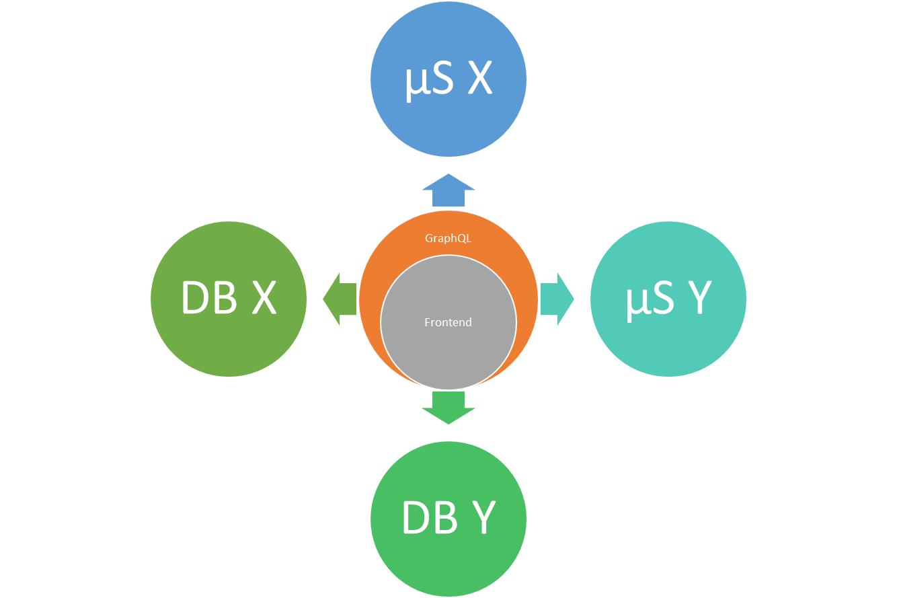

# treasure-map-game
Treasure Map Game Using NodeJS (JavaScript)

## Presentation of the project

The Peruvian government has authorized adventurers seeking treasures to explore the 85,182 km2 of the Madre de Dios department. Treasure Map Game is used to track the movements and collections of treasures made by adventurers.

Here is the map to be displayed by the Frontend:


The application consists of:
- a frontend to display and download the movements and collections of treasures made by adventurers.
- a GraphQL BFF to manage required output for all supported devices (mobile, web, etc.).
- a CMS module that exposes required static data.
- a commons module that holds all transversal commons utils and core.

🔴 **Note that for a primary need (static data display), no BFB module is added and no database is configured.**

## Software architecture

The chosen architecture is a microservice architecture.

The efficient and lightweight nature of Node.js makes it the ideal platform for developing microservices.

What we gain from such an architecture is:
- low coupling between modules.
- flexibility of evolution (evolutionary architecture).
- resilience.
- independence in updates, maintenance and deployments.
- handle unexpected challenges and changes.

Our current architecture is modeled as follows:


This architecture accepts and tolerates updates, for example:


The main idea is to protect the frontend domain as much as possible and avoid structural change and regressions if a new service has been added to the pipeline:



The graphql opens several ports to attach other data sources: microservices, databases, CMS, etc. 
The coupling between graphql and data sources is weak, which allows for easy swappable data sources.

## Technical stack

## Global project

- pnpm as [packages manager](https://pnpm.io/installation).
- pnpm as a [mono-repo/workspaces](https://pnpm.io/workspaces) manager.
- [NX](https://nx.dev/) to boost node tasks: lint, test, build, ...
- [husky](https://typicode.github.io/husky/) git hooks to add special tasks before commit and push.

## Frontend

- [ES6+](https://www.w3schools.com/js/js_es6.asp).
- [Functional Programming](https://betterprogramming.pub/simplified-functionaldd-programming-fdc07b4b1084).
- [Next.js](https://nextjs.org/) for SSR rendering.
- [React 18](https://react.dev/) as Frontend UI.
- [Tanstack Query](https://tanstack.com/) as asynchronous state management (graphql calls and cache).
- [Jest](https://jestjs.io/) as test runner.
- [React Testing Library](https://testing-library.com/docs/react-testing-library/intro/) as testing framework.
- [ESLint](https://eslint.org/) as static analyzer.
- [Airbnb ESLint Configuration](https://github.com/airbnb/javascript).
- Other recommanded ESLint plugins and configurations: react, react-hooks, jsx-a11y, code complexity. 
- [Babel](https://babeljs.io/) as cross-browser transpiler.
- [Webpack 5](https://webpack.js.org/blog/2020-10-10-webpack-5-release/) as frontend bundler.

## Backend

- [ES6+](https://www.w3schools.com/js/js_es6.asp).
- [Functional Programming](https://betterprogramming.pub/simplified-functionaldd-programming-fdc07b4b1084).
- [NodeJS 20](https://nodejs.org/en/blog/announcements/v20-release-announce).
- [Apollo GraphQL Server](https://www.apollographql.com/docs/apollo-server/).
- [Express](https://expressjs.com/).
- [pm2](https://pm2.keymetrics.io/) for production.
- [nodemon](https://www.npmjs.com/package/nodemon) for local development.
- [Jest](https://jestjs.io/) as test runner.
- [ESLint](https://eslint.org/) as static analyzer.
- [Google ESLint Config](https://github.com/google/eslint-config-google).

## How to install?

### Install dependencies

From the root folder:

```js
pnpm install
```

This will install all needed dependencies for main and sub modules.


### Start all microservices in local mode:

From the root folder:

```js
pnpm start:dev
```

This will use NX to call all `start:dev` scripts.

In local mode, BFF and CMS module will use `nodemon`.

API documentation is accessible through this link:
```js
http://localhost:5001/treasure-map/graphql
```

Other available routes:
```js
http://localhost:5001/treasure-map/graphql
http://localhost:5000/treasure-map/cms/monitoring
http://localhost:5000/treasure-map/cms/health-checks
http://localhost:5000/treasure-map/cms/data-store/treasure-map
```

### Start all microservices in production mode:

From the root folder:

```js
pnpm start
```

This will use NX to call all `start` scripts.

In production mode, BFF and CMS module will use `pm2`.

### Lintify all modules

From the root folder:

```js
pnpm lint
pnpm lint:fix
```

This will use NX to call all `lint` or `lint:fix` scripts.


### Testify all modules

From the root folder:

```js
pnpm test
pnpm test:update
```

This will use NX to call all `test` or `test:update` scripts.

### Health checks

All 'health check' routes are exposed through:

```js
baseUrl/health-checks
```

### Monitoring

It's possible to monitor each microservice through an exposed route or pm2:

```js
baseUrl/monitoring

// or
pnpm monitor
pnpm info
pnpm logs
```
